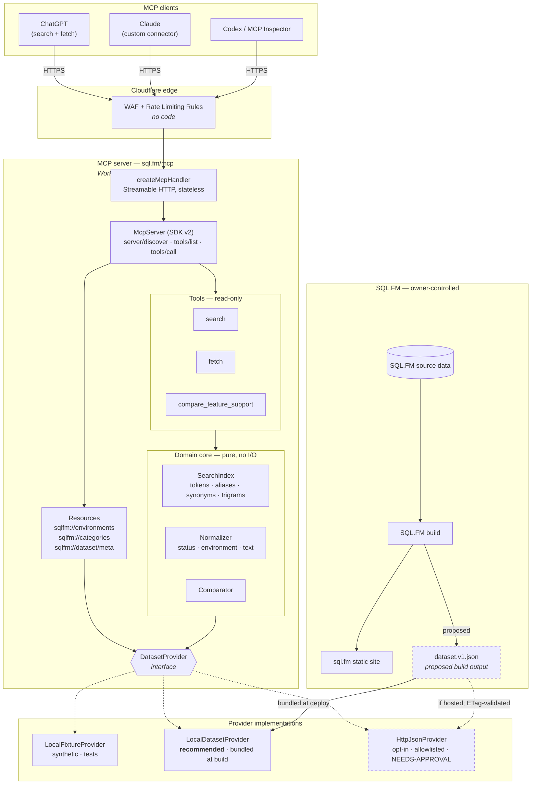

# SQL.FM MCP Server — Architecture and Design (Phase 1)

**Status:** Proposal. Not implemented. Awaiting design approval, and separately awaiting
data-use permission from the SQL.FM owner.

**Date:** 2026-09-02
**Target MCP specification:** `2026-07-28` (current revision), with legacy-client compatibility
**Prepared for handoff to:** Mike Scalise, owner and maintainer of SQL.FM

> **This project is not affiliated with, endorsed by, or sponsored by SQL.FM or Mike Scalise.**
> It is a proposal offered for adoption as a first-party SQL.FM component. Nothing in this
> repository should be presented as official until the owner says so.
>
> **This project is also not affiliated with Microsoft.** SQL.FM itself states it is an
> independent reference site, and that framing carries through here.

---

## 1. Executive summary

SQL.FM publishes a curated SQL Server feature matrix — 334 features across 19 SQL Server
releases, 4 editions, and 2 Azure SQL environments — as a statically hosted Cloudflare site.
The data is high quality, carefully qualified, and sourced to Microsoft Learn. It is exactly
the kind of reference that language models get wrong from memory and get right from retrieval.

This document proposes a small, read-only MCP server that exposes that matrix to ChatGPT,
Claude, Codex, and any other MCP client, through three tools: `search`, `fetch`, and
`compare_feature_support`.

**Recommendation in one line:** a stateless TypeScript server on the Cloudflare Workers runtime
at `https://sql.fm/mcp`, built on MCP SDK v2 and Cloudflare's `createMcpHandler`, reading a
versioned `dataset.v1.json` generated by the *existing SQL.FM build* and bundled at deploy time
— shipping as a standalone Worker, and moving into the SQL.FM Pages project as a Function on
adoption (§5.3.1). A local stdio entry point is supported throughout for development, MCP
Inspector, and fixture-backed demos (§5.6).

Four things drive that recommendation:

1. **SQL.FM already builds a dataset.** Investigation (§3) confirms the site's data asset is a
   clean relational export — releases, editions, categories, features, a compact support matrix,
   cloud support, timeline events, and aliases. A build step that emits a stable, documented
   JSON file alongside the hashed frontend bundle is a small change to a build that already runs.
   Everything downstream becomes simple.
2. **Scraping is not viable and not welcome.** SQL.FM renders entirely client-side — a feature
   page's HTML contains a title, a meta description, and a canonical URL, and nothing else. The
   only non-first-party path is parsing a hash-named, `immutable`-cached JavaScript bundle whose
   filename changes on every deploy. Independently, `robots.txt` disallows `GPTBot`, `ClaudeBot`,
   `CCBot`, `Google-Extended` and others outright, and sets `Content-Signal: ai-train=no`. The
   owner has already expressed a restrictive posture toward AI ingestion (§4.1). The first-party
   path is both the better engineering and the only respectful one.
3. **The hosting decision is nearly free.** SQL.FM is on Cloudflare Pages. The same runtime
   serves a first-party `sql.fm` URL, costs effectively nothing at this traffic, and adds no
   infrastructure for the owner to operate — and because Pages Functions run on the Workers
   runtime, the adoption path is to move the same code *into* the SQL.FM project, where it
   deploys with the site as one artifact (§5.3.1).
4. **The hard part is not the protocol, it's the semantics.** The dataset distinguishes
   `available`, `unavailable`, `not_applicable`, `preview`, and `unknown` on-premises, plus
   `conditional` in Azure. Collapsing those into a boolean would produce confidently wrong
   answers — which is the single worst outcome for a reference tool. §7 makes non-collapse a
   structural property of the design rather than a convention.

**Scope discipline.** V1 is three tools, one dataset file, no database, no vector store, no
authentication, no write path, and no runtime dependency on the SQL.FM website.

**Estimated effort:** ~5–7 focused days to a deployable, tested V1 (§17). Ongoing maintenance
is close to zero when integrated first-party, because the dataset regenerates with the site.

**Blocking on the owner:** data-use permission, and a decision on where the dataset file lives.
Neither blocks writing the code — V1 is built and tested entirely against synthetic fixtures.

---

## 2. What was verified, and how

Every claim below was checked against the live site on 2026-09-02, not assumed. The user's
stated observations were all correct; the investigation adds specifics that change the design.

| Observation | Verdict | Evidence |
|---|---|---|
| Static Cloudflare-hosted site | **Confirmed** | `server: cloudflare`, `cf-ray` headers; Cloudflare Pages Analytics beacon in HTML |
| Matrix loaded from a versioned JS data asset | **Confirmed** | `<script src="assets/data.77620a156199.js">` assigns `window.SQLFM_DATA` |
| Feature URLs are `https://sql.fm/features/{slug}/` | **Confirmed** | `<link rel="canonical" href="https://sql.fm/features/string-agg/">`; 334 such URLs in `sitemap.xml` |
| No MCP endpoint, REST API, OpenAPI doc, or plugin | **Confirmed** | `/data/features.json`, `/api/features.json`, `/features.json`, `/openapi.json`, `/llms.txt`, `/.well-known/mcp.json` all return 404 |
| Hashed filename must not be a hard dependency | **Confirmed, and stronger than stated** | Asset is served `cache-control: public, max-age=31536000, immutable` — by construction the filename changes on every data change |
| An SQL.FM source repository is available | **Not found** | No public repo linked from the site, and none discoverable. Treated as an open question for the owner (§15 Q1) |

Three findings that were **not** in the original brief and that materially shape the design:

**F1 — The site is 100 % client-rendered.** `curl https://sql.fm/features/string-agg/` returns a
~400-character shell: a `<title>`, a `<meta name="description">`, a canonical link, and three
globals (`SQLFM_BASE_PATH`, `SQLFM_INITIAL_VIEW`, `SQLFM_INITIAL_SLUG="string-agg"`). All
content comes from the data bundle. **HTML scraping yields nothing usable** — it is not a
degraded option, it is a non-option. This removes an entire branch of the decision tree.

**F2 — `robots.txt` expresses a restrictive AI posture.** Reproduced in §4.1. This is the most
important non-technical finding in the document.

**F3 — The dataset is a relational export, not a hand-authored blob.** Integer primary keys,
foreign keys, a parent/child category tree, a run-length-friendly compact matrix encoding, and
a normalized notes table. This is generated from a structured source (§3). A build-time JSON
export is therefore a *formatting* change, not a data-modelling project — which is why §6
recommends it with confidence.

**Method note.** Inspection was deliberately minimal and bounded: the homepage, one feature
page, `robots.txt`, `sitemap.xml`, the about page, and a single transient read of the data
asset to determine its schema. The status-code legend was read from the app bundle. **No copy
of the SQL.FM dataset was retained**; the working files were deleted after the schema was
recorded, and no SQL.FM content is committed to this repository. What survives that inspection
is in §3 — a description of the *shape* of the data, which is what a design needs.

---

## 3. The SQL.FM data model (as observed)

`window.SQLFM_DATA` has ten top-level keys:

| Key | Shape | Count | Notes |
|---|---|---|---|
| `releases` | `{id, name, major, service, year, sort}` | 19 | SQL Server 1.0 (1989) → SQL Server 2025 (17.0) |
| `editions` | `{id, name, sort}` | 4 | Standard, Enterprise, Developer, Express |
| `categories` | `{id, name, parent_id, parent_name, sort}` | 36 | Two-level tree; 8 roots |
| `features` | `{id, name, slug, type, category, category_id, parent_category, description, docs, attributes}` | 334 | `docs` is a Microsoft Learn URL — **present on all 334** |
| `support_compact` | `{stride: 4, rows: [[feature_id, "76-char string"]]}` | 334 | The on-premises matrix |
| `cloud_support` | `{feature_id, target_id, status, note, source}` | 668 | 334 × 2 targets, fully dense |
| `cloud_targets` | `{id, name, short, docs, sort}` | 2 | Azure SQL Database, Azure SQL Managed Instance |
| `events` | `{feature_id, release_id, edition_id, event_type, summary, source}` | 250 | `introduced`, `edition_changed`, `first_verified` |
| `release_notes` | `{id, feature_id, release_id, edition_id, note, source}` | 7 | Long-form qualifications |
| `aliases` | `{feature_id, alias}` | 8 | e.g. `TDE`, `Hekaton`, `AG`, `PSP` |

### 3.1 The compact support matrix

`support_compact.rows` is `[feature_id, statusString]`. The string is
`releases.length × stride` = `19 × 4` = **76** characters, ordered by `releases` sorted by
`sort`, then `editions` sorted by `sort` (Standard, Enterprise, Developer, Express).

The status legend was read directly from the app bundle:

```js
a:'available'  u:'unavailable'  n:'not_applicable'  '?':'unknown'  p:'preview'
```

Observed frequency across all 25,384 cells: `a` 13,648 · `u` 8,381 · `n` 3,309 · `p` 28 · `?` 18.

Decoding was validated against four features with independently known behaviour:

| Feature | Decoded result | Matches reality |
|---|---|---|
| `string-agg` | `unavailable` through 2016, `available` 2017 → 2025, all editions | ✅ STRING_AGG shipped in 2017 |
| `date-bucket` | `unavailable` through 2019, `available` 2022 → 2025 | ✅ DATE_BUCKET shipped in 2022 |
| `accelerated-database-recovery` | `unavailable` through 2017, `available` 2019 → 2025, **all four editions** | ✅ ADR is not edition-restricted |
| `online-index-operations` | Enterprise + Developer `available`; **Standard and Express `unavailable`**, 2016 → 2025 | ✅ Enterprise-only feature |

That last row is the design's canary. *"Does SQL Server 2019 Standard support online index
rebuilds?"* — the brief's first example question — resolves to `unavailable` for Standard while
Enterprise is `available` **in the same release**. Any design that reduces a feature to
"supported since 2016" answers that question wrongly. Edition must be a first-class axis, not
a footnote.

`not_applicable` is likewise load-bearing: it marks editions that did not exist in a release
(e.g. Express before 2005). Rendering it as "not supported" would be a factual error about
history. It is a distinct status all the way through the pipeline.

### 3.2 Gaps in the current dataset

These are honest limitations, surfaced now rather than discovered during implementation:

- **Compatibility level is effectively absent.** The phrase "compatibility level" appears
  **once** in the entire dataset, in free-text prose. "Trace flag" appears zero times. The brief
  asks for compatibility-level requirements; **the data to answer that does not exist today**.
  The schema in §7 reserves a typed field for it, populated as `null`, and the tools report it
  as unknown rather than inventing it. → §15 Q4.
- **On-premises support has no `conditional` state.** `conditional` exists only in
  `cloud_support`. On-premises qualifications live in `events` (250) and `release_notes` (7).
  Seven long-form notes across 334 features is thin coverage for a "conditions and
  qualifications" requirement. → §15 Q5.
- **Aliases are sparse — 8 rows total.** Search recall cannot depend on them (§9.4).
- **No dataset version or generation timestamp.** Nothing in the payload identifies which build
  produced it. Freshness reporting needs one. → §15 Q3, and it is the cheapest of the requested
  additions.
- **`features[].attributes` is present but empty on all 334 rows.** Reserved upstream; carried
  through as an opaque passthrough field, not interpreted.

---

## 4. Permission, ownership, and what this design refuses to do

### 4.1 What `robots.txt` says

`https://sql.fm/robots.txt` carries Cloudflare-managed content signals:

```
User-agent: *
Content-Signal: search=yes,ai-train=no,use=reference
Allow: /

User-agent: GPTBot
Disallow: /

User-agent: ClaudeBot
Disallow: /

User-agent: CCBot
Disallow: /

User-agent: Google-Extended
Disallow: /
```

(also `Amazonbot`, `Applebot-Extended`, `Bytespider`, `meta-externalagent`,
`CloudflareBrowserRenderingCrawler`.)

Read plainly: **search indexing yes, AI training no, reference use permitted, and the major AI
crawlers are disallowed outright.**

Two observations, offered without lawyering — this is the owner's call, not mine:

- A retrieval tool that returns a short excerpt and a canonical citation sits close to
  `use=reference`, which is signalled permissively. It is not training, and `ai-train=no` is not
  implicated.
- But the `Disallow: /` entries are unambiguous about *automated collection*, and the signals
  say nothing either way about `ai-input`. Whatever the fine reading, the owner has taken the
  trouble to express a restrictive position, and the correct response to that is to ask rather
  than to interpret.

### 4.2 Consequences for the design

This is not a disclaimer paragraph; it is a set of enforced properties:

1. **V1 ships with synthetic fixtures only.** No SQL.FM content is committed to this repository,
   at any point, until permission is explicit and in writing.
2. **No provider that reads sql.fm at runtime is enabled by default.** `HttpJsonProvider`
   (§6.4) exists in the design, is off unless configured, and its allowlist is empty until the
   owner names an endpoint. A misconfiguration cannot silently start fetching the site.
3. **No scraping provider is designed, built, or shipped.** Not the HTML (F1 makes it useless
   anyway), and not the hashed bundle. If the owner ever explicitly asks for a bundle-parsing
   fallback, that is a separate decision with its own review — it is not in this design.
4. **Attribution is structural.** Every tool result carries a canonical SQL.FM URL, an
   attribution string, and the non-affiliation disclaimer, in structured output rather than in
   prose a model can drop (§13).
5. **The stated goal is transfer.** MIT-licensed, no vendor lock-in, no service dependency on
   the author, documented well enough to hand over. §16 is a handoff checklist, not a support
   contract.

### 4.3 Assumptions requiring owner approval

Marked **[NEEDS-APPROVAL]** wherever they appear:

- **A1** — that a machine-readable dataset may be generated from SQL.FM's source data and
  served from a stable URL or bundled into a Worker.
- **A2** — that feature text (name, summary, notes, statuses) may be returned to MCP clients
  with attribution.
- **A3** — that the service may be operated at a `sql.fm` URL.
- **A4** — that V1 may be public and unauthenticated.
- **A5** — that Microsoft Learn URLs carried in the dataset may be passed through as citations.
  (Low risk: these are public documentation links, and passing them through is what makes the
  answers checkable.)

---

## 5. Recommended architecture

### 5.1 Decision

| Dimension | Choice |
|---|---|
| Language | **TypeScript** (strict), Node 22+ toolchain |
| MCP SDK | **`@modelcontextprotocol/server` v2** — the SDK v2 line implementing spec `2026-07-28` |
| Runtime / hosting | **Cloudflare Workers runtime**, via `createMcpHandler` from `agents/mcp/server`. Three deployment shapes — see §5.3.1 |
| Transport | **Streamable HTTP at `/mcp`**, stateless; `legacy: "stateless"` for older clients |
| Local development | **stdio entry point** — same core, no hosting, no network (§5.6) |
| Data source | **Build-time generated `dataset.v1.json`, bundled into the Worker** |
| Search | **Deterministic in-process index**, built at cold start |
| Auth | **None in V1** (public, read-only) — optional and additive later (§12.6) |
| State | **None.** No database, no KV, no Durable Objects, no session |

### 5.2 Why TypeScript + MCP SDK v2

- The `2026-07-28` revision is a large break from `2025-11-25`: protocol-level sessions and the
  `initialize` handshake are gone, every request carries its own protocol version and
  capabilities in `_meta`, `server/discover` is mandatory, all results carry `resultType`, and
  list results must carry `ttlMs` / `cacheScope`. Hand-rolling that is a mistake. **The SDK's
  job is to absorb this revision and the next one.**
- SDK v2 was replatformed from Node APIs onto Web Standards, specifically so it runs on Workers.
  TypeScript is the only stack where the recommended SDK and the recommended runtime are the
  same first-class path.
- Zod schemas serve as one source of truth for `inputSchema`, `outputSchema`, and runtime
  validation, which is what keeps §14's schema tests cheap.
- It matches SQL.FM's existing stack. A first-party handoff to a Cloudflare site should not
  arrive with a Python runtime attached.

### 5.3 Why the Cloudflare Workers runtime

- **Same platform as SQL.FM.** One account, one `wrangler deploy`, one dashboard, one bill.
- **A first-party URL.** A Worker route on the existing zone serves `https://sql.fm/mcp`
  directly. This is what makes the result feel official rather than bolted on — and it is worth
  more than it sounds, because the MCP endpoint URL is what users paste into ChatGPT and Claude.
- **Stateless matches the protocol.** `2026-07-28` removed sessions; `createMcpHandler` is
  stateless by design. The old `McpAgent` + Durable Object approach is deprecated and
  feature-frozen. The recommended path is also the simpler one.
- **Cost and operations.** At any plausible traffic level this is inside the free tier, with no
  servers, no patching, and no scaling work. For a project being handed to a single maintainer,
  operational burden is a first-order design constraint.
- **Free abuse controls.** Cloudflare WAF and Rate Limiting Rules sit in front of the Worker
  with no code (§12.4).

**The honest cost:** the 128 MB memory and CPU-time limits, and the bundle size limit. §6.3
shows the dataset fits with an order of magnitude to spare, and §9.6 shows index construction
is single-digit milliseconds. Neither is close to binding. If SQL.FM grew 20×, §18 says what
changes.

### 5.3.1 Three deployment shapes on Cloudflare

SQL.FM runs on **Cloudflare Pages**. Pages Functions execute on the same Workers runtime as a
standalone Worker, so all three shapes below run *identical* code — `createMcpHandler` returns a
plain `fetch(request, env, ctx)` handler, and each shape is a different ~15-line adapter around
it. This is what makes the progression cheap: choosing one now does not foreclose the others.

**Shape A — standalone Worker on the `sql.fm` zone. Recommended for V1.**

A separate Worker, its own repository, routed at `sql.fm/mcp` via a zone route. This is the
right V1 shape for a reason that is about permission rather than engineering: **until the owner
grants permission, the code cannot live in his repository.** A standalone Worker is deployable
and demonstrable today, on `workers.dev` with synthetic fixtures, with no involvement from him
at all. It also keeps MCP concerns out of the site repo, which some maintainers will prefer
permanently.

Cost: a second deploy step, and the bundle-vs-HTTP question (§6) is live because the site build
and the Worker deploy are separate pipelines.

**Shape B — Pages Function inside the SQL.FM project. The adoption target.**

A function at `functions/mcp/[[path]].ts` in the SQL.FM repository, delegating to the same
handler:

```ts
// functions/mcp/[[path]].ts — Cloudflare Pages Function
import { onRequest as mcp } from '../../src/pages';
export const onRequest = mcp;   // wraps createMcpHandler(createServer)
```

This is materially better than Shape A *once permission exists*:

- **One artifact, one deploy.** The MCP server ships with the site. There is no second pipeline
  to remember and no window in which code and data disagree.
- **The bundle-vs-HTTP question disappears entirely.** The build that generates
  `dataset.v1.json` is the build that deploys the function. Data and server are always in sync
  by construction — not by a refresh interval, and not by discipline.
- **`sql.fm/mcp` with no routing configuration.** The path is just a file in the project.
- **Genuinely first-party.** One repo, one deploy, one thing to hand over — which is the whole
  point of the exercise.

Cost: the MCP code lives in the site repository, so the site's build and test pipeline grows.
For a project of this size that is a small, one-time cost.

**Shape C — one Worker serving both site and `/mcp`. The likely end state.**

Workers gained native static-asset hosting and, as of March 2026, has full parity with Pages
for static assets, SSR, and custom domains. Cloudflare now recommends Workers-with-static-assets
for *new* projects. Pages remains fully supported and there is no need to migrate an existing
project, so this is **not** a recommendation to move SQL.FM — but if it ever migrates, Shape B
collapses into Shape C: a single Worker serving the static site and handling `/mcp`, with the
dataset in the same build output. Migration is a configuration change (an `assets` binding in
`wrangler.jsonc`, bindings and domains re-declared), not a rewrite, and the MCP code is
unaffected because it is the same handler behind a different adapter.

**Recommended progression:** ship Shape A → offer Shape B as the adoption path when permission
lands → let Shape C follow SQL.FM's own hosting choices, whenever and if ever it makes them.

### 5.4 Component architecture



Everything inside the server box is identical across all three deployment shapes (§5.3.1) and
the local stdio mode (§5.6) — only the outermost adapter differs, and the edge box applies only
to the hosted shapes.

**Layering rule, enforced by directory and by test:** the domain core is pure — it takes a
`Dataset` value and returns values, with no network, no clock, and no environment access. That
is what makes §9's ranking testable and §14's acceptance tests fast. Providers own all I/O.
Tools own only schema validation and shaping. No tool may import a provider implementation
directly; it receives a `DatasetProvider`.

### 5.5 Request path

```
POST /mcp  (Mcp-Method: tools/call, Mcp-Name: search)
  → Cloudflare WAF / rate limit
  → createMcpHandler: parse, validate headers, negotiate protocol version from _meta
  → McpServer: route to tool
  → Zod: validate input; reject with structured error on failure
  → provider.getDataset()  → in-memory, resolved once per isolate
  → domain core: pure computation
  → shape: { content: [text], structuredContent: {...} }
  → response
```

No request performs a network fetch under the recommended provider. Tail latency is dominated
by cold start (~10–30 ms including index construction), and warm requests are sub-millisecond.

### 5.6 Local and stdio mode

A **local stdio entry point is a first-class supported mode**, not a fallback. The domain core
is deliberately pure and runtime-agnostic (§5.4), so this is a small adapter over the same
`McpServer` factory the Worker uses:

```ts
// src/stdio.ts
import { StdioServerTransport } from '@modelcontextprotocol/server';
import { createServer } from './server';
await createServer().connect(new StdioServerTransport());
```

It exists for three reasons, all of which apply regardless of what gets hosted:

1. **Development and debugging.** `npm run dev:stdio` with fixtures, no network, no deploy.
2. **MCP Inspector.** Inspector drives stdio directly — the fastest loop for verifying tool
   shapes, schemas, and annotations (§14.2 case 13).
3. **Demonstration.** Anyone — including the owner, evaluating the proposal — can run
   `npx sqlfm-mcp` against synthetic fixtures and see the tools work in Claude Desktop, Claude
   Code, or Codex, without a hosted service existing and without any permission question
   arising.

`--http` additionally serves Streamable HTTP on `localhost:8788/mcp` for clients that prefer
HTTP, using the same handler as the Worker. Both modes are covered by the transport tests
(§14.1), because an untested entry point is one that breaks silently.

#### Why local is not the *distribution* answer

It is tempting to read "local server" as a way around the permission question (§4). It is the
opposite — it sharpens it. There are only two ways to get **real** data onto a user's machine,
and both are worse for the owner than a hosted service:

| Approach | Problem |
|---|---|
| Ship the dataset inside the npm package | This is precisely bulk copy, redistribution, and permanent packaging of the complete dataset. Once published it cannot be updated, corrected, or revoked, and the owner has no visibility into who holds a copy |
| Fetch from sql.fm on first run and cache locally | Every user's machine hits sql.fm directly: uncontrolled fan-out, no shared cache, no rate limiting, no observability — from user agents `robots.txt` currently disallows (§4.1) |

A hosted service is the shape that keeps the owner in control: one origin, one cache,
rate-limitable at the edge, observable, revocable, and the data never leaves infrastructure he
owns. For a project whose stated goal is a first-party handoff, that governance property
outweighs the convenience of local execution.

**Therefore:** stdio and local HTTP are supported for development, testing, and
**fixture-backed** demos. Distributing real SQL.FM data in an npm package is out of scope for
this design and would need its own explicit permission conversation.

---

## 6. Data-source strategy

### 6.1 The provider abstraction

```ts
export interface DatasetProvider {
  readonly kind: 'fixture' | 'local' | 'http';
  /** Resolved dataset. Implementations cache; callers may call freely. */
  getDataset(): Promise<Dataset>;
  /** Freshness and provenance, for sqlfm://dataset/meta and /health. */
  getMeta(): Promise<DatasetMeta>;
}

export interface DatasetMeta {
  schema_version: string;      // semver of the dataset contract, e.g. "1.0.0"
  dataset_version: string;     // opaque upstream build id
  generated_at: string | null; // ISO-8601, or null if upstream omits it
  content_hash: string;        // sha256 of canonical JSON — always computable
  source_kind: 'fixture' | 'local' | 'http';
  fetched_at: string;
  stale: boolean;              // true when serving last-known-good after a failed refresh
  feature_count: number;
  environment_count: number;
}
```

The interface is deliberately tiny. Everything above it is pure, so swapping providers cannot
change an answer — only where the bytes came from. That is what makes fixture-driven acceptance
tests meaningful evidence about production behaviour.

### 6.2 `LocalFixtureProvider` — development and tests

Loads a hand-written synthetic dataset from `fixtures/synthetic/`. **No SQL.FM content.** It is
the default in `test` and the fallback when no dataset is configured, so a fresh clone runs and
tests green with zero setup and zero permission questions.

Fixtures are designed to exercise every semantic edge (§14.2), not to be realistic: invented
feature names (`WIDGET_AGG`, `Sparkle Compression`), invented product line, but the *same*
status vocabulary, the same environment grammar, and the same sparse-data shapes.

### 6.3 `LocalDatasetProvider` — the recommendation

Reads `dataset.v1.json` imported at build time and bundled into the Worker.

```ts
import datasetJson from '../../data/dataset.v1.json';
```

Why this is the right default:

- **No runtime I/O.** No timeouts, no retries, no cache invalidation, no partial reads, no
  stale-data logic on the hot path, and — see §12 — no SSRF surface whatsoever. A large fraction
  of this document's error handling and caching machinery simply does not execute.
- **Atomic and reversible.** Code and data version together. `wrangler rollback` reverts both
  in one action. There is no state in which the Worker runs new code against old data.
- **Trivially verifiable.** The deployed content hash is a build artifact. "What data is live?"
  has an exact answer.
- **Fits comfortably.** The site's raw data asset is 558 KB. Preserving the compact matrix
  encoding (§7.3), `dataset.v1.json` lands in the same range and compresses to well under
  200 KB — against a 3 MB compressed Worker limit on the free plan, 10 MB on paid.

The cost is that a data change requires a Worker deploy. Given the site is *already* rebuilt and
redeployed on every data change, this is one added step in an existing pipeline, not a new
operational burden. §11.1 covers it.

**Under Shape B (§5.3.1) that cost disappears entirely**, which is the strongest argument for
the Pages Function: the build that generates `dataset.v1.json` is the build that deploys the
server, so data and code are in sync by construction rather than by a refresh interval or by
someone remembering a second deploy. Bundle-vs-HTTP stops being a question at all.

### 6.4 `HttpJsonProvider` — opt-in, owner-approved only **[NEEDS-APPROVAL: A1]**

For the case where the owner prefers the MCP service to track SQL.FM deploys without a Worker
redeploy.

- Fetches a **single, exact, allowlisted URL** from configuration. Never a URL from user input,
  and never composed from tool arguments (§12.2).
- Conditional GET with `If-None-Match` / `If-Modified-Since`; a `304` refreshes the TTL without
  re-parsing.
- Refresh on TTL expiry (default 900 s), never on the request path — a request is served from
  cache while a refresh runs behind it.
- Single-flight: concurrent refreshes collapse to one upstream request.
- Failure → **serve last-known-good** and set `meta.stale = true`. A refresh failure must never
  turn into a tool error or an empty result.
- Hard limits: 5 s timeout, 2 MB response cap, 2 retries with jittered backoff.
- **Disabled unless `SQLFM_DATASET_URL` is set, and the allowlist is empty until the owner names
  an endpoint.** Absent both, the Worker refuses to start rather than silently reaching for the
  website.

**The hybrid, if deploy-independence is wanted.** Bundled and HTTP compose: bundle a dataset as
the floor, and layer HTTP refresh on top. A cold isolate never blocks on a fetch because it
already has data, an upstream outage is a no-op rather than a degradation, and changes are still
picked up between deploys. This is the recommended configuration for Shape A if the owner wants
the MCP server to track the site without a second deploy — it costs only that the fetch code
still exists and still has to be tested. Under Shape B it is unnecessary.

### 6.5 The proposed upstream contract **[NEEDS-APPROVAL: A1]**

The ask of SQL.FM's build is one file at a stable path, e.g. `https://sql.fm/data/features.json`
(exact path is the owner's choice — §15 Q2), with:

- A **stable, unhashed** path — the whole point is that it survives deploys.
- `Content-Type: application/json`, a strong or weak `ETag`, and `Last-Modified`.
- `Cache-Control: public, max-age=300, must-revalidate` — short, revalidating, *not* `immutable`.
- `schema_version`, `dataset_version`, and `generated_at` inside the payload.
- Additive evolution only within a `schema_version` major.

This file is useful beyond MCP — it is the thing anyone would want in order to build against
SQL.FM, and it costs the build a serialize-and-write.

### 6.6 Explicitly rejected data sources

| Source | Why rejected |
|---|---|
| Scraping rendered HTML | **F1**: pages contain no content. Technically impossible, not merely distasteful |
| Parsing `assets/data.<hash>.js` | Requires discovering a hash from the homepage on every deploy; `immutable` caching means the name *always* changes; brittle by construction; conflicts with §4.1 |
| Headless-browser rendering | All of the above, plus `CloudflareBrowserRenderingCrawler` is explicitly disallowed in `robots.txt` |
| Maintaining a forked copy of the data | Guarantees drift, duplicates the owner's curation work, and is the opposite of a first-party handoff |

---

## 7. Normalized feature-data schema (`dataset.v1`)

Design goals: preserve every SQL.FM distinction, be small enough to bundle, and be stable enough
that the tool contract does not move when SQL.FM adds a release.

### 7.1 Status vocabulary — a closed set of six

```ts
type SupportStatus =
  | 'available'       // supported
  | 'unavailable'     // recorded as not supported
  | 'conditional'     // supported with limitations — see conditions[]
  | 'preview'         // preview / not GA
  | 'not_applicable'  // the environment did not exist in that release
  | 'unknown';        // not yet verified — ABSENCE OF DATA, NOT A NEGATIVE
```

**The invariant, stated once and enforced everywhere:**

> `unknown` and `not_applicable` MUST NEVER be rendered, summarized, aggregated, or defaulted
> as `unavailable`. A missing record is `unknown`. A missing *feature* is an error, not a
> `false`.

How that is enforced structurally rather than by discipline:

- The type is a closed union. There is no boolean `supported` field anywhere in the codebase —
  not in the dataset, not in the domain core, not in tool output. A caller cannot accidentally
  coerce, because there is nothing to coerce to.
- Aggregation across editions uses an explicit lattice (§10.3) in which `unknown` is absorbing,
  not falsy.
- Any result set containing `unknown` carries a populated `warnings[]` and `data_gaps[]`.
- A property test asserts that no input dataset produces an output where a cell recorded as
  `unknown` or `not_applicable` is reported as `unavailable` (§14.1).

### 7.2 Environment identifiers

A single flat, guessable namespace covering all three axes:

| Form | Example | Meaning |
|---|---|---|
| `mssql-<year>` | `mssql-2019` | SQL Server 2019, edition-agnostic (aggregate, §10.3) |
| `mssql-<year>-<edition>` | `mssql-2019-standard` | A specific edition |
| `azure-sql-db` | — | Azure SQL Database |
| `azure-sql-mi` | — | Azure SQL Managed Instance |

Editions: `standard`, `enterprise`, `developer`, `express`. Pre-2000 releases use their version
string: `mssql-6-5`, `mssql-7-0`, `mssql-4-21a`.

Aliases accepted on input and normalized (`"SQL Server 2019 Standard"`, `"2019 std"`,
`"Azure SQL Database"`, `"managed instance"`, `"SQL MI"`, `"azuresqldb"`). Output always uses
the canonical id, so results are stable regardless of how the model phrased the request.

**Why a pattern rather than a schema `enum`.** The full set is 19 releases × 4 editions + 19
aggregates + 2 cloud = **97 ids**. An `enum` of 97 strings would appear in every `tools/list`
response, in every client's context, forever. Instead the schema uses a `pattern`, the
description states the grammar with examples, `sqlfm://environments` lists the full set, and an
unrecognized id returns a structured `unknown_environment` error whose `valid_environments`
field lets the model self-correct in a single turn. The grammar is guessable enough that
correction is rarely needed; when it is needed, it costs one round trip instead of ~1.5 KB on
every listing.

### 7.3 Dataset document

```jsonc
{
  "schema_version": "1.0.0",
  "dataset_version": "2026-09-02T14:00:00Z.ab12cd34",
  "generated_at": "2026-09-02T14:00:00Z",

  "source": {
    "name": "SQL.FM",
    "url": "https://sql.fm/",
    "feature_url_template": "https://sql.fm/features/{slug}/",
    "attribution": "Data from SQL.FM (https://sql.fm/), created and maintained by Mike Scalise.",
    "disclaimer": "SQL.FM is an independent reference and is not affiliated with, endorsed by, or sponsored by Microsoft. Verify against Microsoft documentation before relying on this for production decisions."
  },

  "environments": [
    { "id": "mssql-2019-standard", "kind": "sqlserver", "label": "SQL Server 2019 Standard",
      "release": { "id": "mssql-2019", "name": "SQL Server 2019", "major": "15.0", "year": 2019 },
      "edition": "Standard", "sort": 18004 },
    { "id": "azure-sql-db", "kind": "azure", "label": "Azure SQL Database",
      "short_label": "Azure SQL DB",
      "docs": "https://learn.microsoft.com/en-us/azure/azure-sql/database/sql-database-paas-overview",
      "sort": 90010 }
  ],

  "categories": [
    { "id": 9, "name": "String Functions", "parent_id": 1, "parent_name": "Functions", "sort": 11 }
  ],

  // Compact on-premises matrix, preserved from upstream for size.
  // Expanded on read; never exposed compact through a tool.
  "support_matrix": {
    "encoding": "compact-v1",
    "legend": { "a": "available", "u": "unavailable", "n": "not_applicable",
                "?": "unknown", "p": "preview" },
    "release_order": ["mssql-1-0", "…", "mssql-2025"],
    "edition_order": ["standard", "enterprise", "developer", "express"],
    "rows": { "string-agg": "aan…aaaa" }
  },

  "features": [
    {
      "id": "string-agg",
      "upstream_id": 5,
      "name": "STRING_AGG",
      "slug": "string-agg",
      "url": "https://sql.fm/features/string-agg/",
      "type": "function",
      "category": { "id": 11, "name": "Aggregate Functions", "parent_name": "Functions" },
      "summary": "Concatenates row values with a separator.",
      "aliases": [],
      "microsoft_docs": ["https://learn.microsoft.com/en-us/sql/t-sql/functions/string-agg-transact-sql"],

      "cloud_support": {
        "azure-sql-db": { "status": "available", "note": null,
                          "sources": ["https://learn.microsoft.com/…/features-comparison"] },
        "azure-sql-mi": { "status": "available", "note": null, "sources": ["…"] }
      },

      "timeline": [
        { "event": "introduced", "environment": "mssql-2017", "edition": null,
          "summary": "STRING_AGG introduced.", "source": null }
      ],

      "conditions": [
        { "scope": { "environment": "mssql-2014", "edition": null },
          "note": "…", "source": "https://learn.microsoft.com/…" }
      ],

      "requirements": {
        "compatibility_level": null,   // reserved — not present upstream (§3.2)
        "platform": null,              // reserved
        "other": []
      },

      "attributes": []                 // opaque upstream passthrough
    }
  ]
}
```

### 7.4 Mapping from upstream

| Upstream | `dataset.v1` | Note |
|---|---|---|
| `features[].slug` | `features[].id` | Slug is the stable public id — it is already the canonical URL segment, so `search` → `fetch` → citation round-trips without a lookup table |
| `features[].id` | `features[].upstream_id` | Retained for traceability and bug reports |
| `features[].docs` | `microsoft_docs[]` | Widened to an array; upstream has exactly one today |
| `features[].description` | `summary` | Renamed to match `search` output semantics |
| `support_compact` | `support_matrix` | Encoding preserved verbatim; legend made explicit in-band |
| `cloud_support[]` | `features[].cloud_support{}` | Pivoted to an object keyed by environment id |
| `events[]` | `features[].timeline[]` | `release_id` → environment id; `edition_id` → edition name |
| `release_notes[]` | `features[].conditions[]` | Scoped to `{environment, edition}` |
| `aliases[]` | `features[].aliases[]` | Merged into search input alongside server-side synonyms (§9.4) |

### 7.5 Versioning

`schema_version` is semver over the *dataset contract*. Minor = additive fields; major =
anything a consumer could break on. The server accepts any `1.x` and refuses `2.x` with a clear
startup error rather than silently misreading it. Tool output schemas are versioned
independently — the dataset can gain fields without moving the MCP contract.

---

## 8. MCP tool definitions

All three tools are **read-only, deterministic, side-effect-free, and closed-world**:

```ts
annotations: {
  readOnlyHint: true,
  destructiveHint: false,
  idempotentHint: true,
  openWorldHint: false,   // answers come from a fixed dataset, not the open internet
}
```

Every tool has an explicit `inputSchema` and `outputSchema` (Zod → JSON Schema 2020-12), returns
**both** `structuredContent` and a compact JSON-encoded `content[0].text` — the dual shape
ChatGPT requires and every other client tolerates. Tool names are ≤ 64 characters and carry
human-readable `title`s, per Claude connector-directory requirements.

Descriptions are written to tell a model **when to call**, not just what the tool does — the
single highest-leverage detail in a retrieval server.

### 8.1 `search`

> **Description.** Search the SQL.FM SQL Server feature reference by name, keyword, or natural
> language. Use this first, whenever a question involves whether a SQL Server or Azure SQL
> feature, function, or capability exists, when it was introduced, or which versions or editions
> have it — including questions about T-SQL functions, indexing, high availability, security,
> and Azure SQL differences. Returns candidate features with canonical sql.fm URLs. Call `fetch`
> for full detail on a result, or `compare_feature_support` to compare one feature across
> environments. Do not answer SQL Server version-support questions from memory; search here.

**ChatGPT compatibility.** `query` is the only required parameter and is a plain string, which
satisfies OpenAI's deep-research contract (`search` takes a single query string; `fetch` takes a
single id string). Filters are strictly optional and additive — ChatGPT simply omits them, while
Claude and Codex can use them. This was the deciding constraint on the shape: a filter object
that ChatGPT cannot express would have made the server non-conformant.

```ts
inputSchema: {
  query: z.string().min(1).max(200)
    .describe('Feature name, keyword, or natural-language question. Examples: "STRING_AGG", "online index rebuild", "which version added DATE_BUCKET".'),
  category: z.string().max(80).optional()
    .describe('Restrict to a SQL.FM category, e.g. "Indexing", "Security". See sqlfm://categories.'),
  environment: z.string().max(60).optional()
    .describe('Restrict to features recorded as available in one environment. Grammar: "mssql-<year>[-<edition>]", "azure-sql-db", "azure-sql-mi". Examples: "mssql-2019", "mssql-2019-standard".'),
  status: z.enum(['available','unavailable','conditional','preview','not_applicable','unknown']).optional()
    .describe('Used with `environment`: keep only features with this status there. Defaults to "available".'),
  limit: z.number().int().min(1).max(50).default(10),
}
```

```ts
outputSchema: {
  results: z.array(z.object({
    id: z.string(),                 // slug — pass to fetch / compare_feature_support
    title: z.string(),              // "STRING_AGG"
    url: z.string().url(),          // canonical — use this to cite
    summary: z.string(),
    category: z.string(),
    score: z.number(),              // 0–1000, see §9
    match_reason: z.enum(['exact_slug','exact_name','alias','prefix','tokens','description','fuzzy']),
  })),
  total_matched: z.number().int(),  // before `limit`
  truncated: z.boolean(),
  query_interpretation: z.object({
    normalized_query: z.string(),
    tokens: z.array(z.string()),
    synonyms_applied: z.array(z.string()),
    filters: z.object({ category: z.string().nullable(),
                        environment: z.string().nullable(),
                        status: z.string().nullable() }),
  }),
  attribution: z.string(),
  source: z.object({ name: z.literal('SQL.FM'), url: z.string().url() }),
}
```

`match_reason` and `query_interpretation` are not decoration: they make ranking debuggable from
a client transcript, and they let a model see that its misspelling was fuzzy-corrected — which
measurably reduces "are you sure?" follow-ups.

Empty result set → `results: []`, `total_matched: 0`, plus a `suggestions[]` of up to 5 nearest
features by edit distance. **An empty search is not an error** (§14.2 case 10).

### 8.2 `fetch`

> **Description.** Retrieve the complete SQL.FM record for one feature: its full support matrix
> across every SQL Server release and edition, Azure SQL Database and Managed Instance status,
> introduction history, conditions and qualifications, and Microsoft documentation links. Call
> this after `search` returns a candidate, using the `id` from the result. Use
> `compare_feature_support` instead when the question is specifically about a small set of named
> versions or editions.

```ts
inputSchema: {
  id: z.string().regex(/^[a-z0-9][a-z0-9-]{0,63}$/)
    .describe('Feature id (slug) from a search result, e.g. "string-agg".'),
}
```

The regex is the path-traversal control (§12.3), applied before any lookup.

```ts
outputSchema: {
  id: z.string(),
  title: z.string(),
  text: z.string(),        // composed model-readable prose — see below
  url: z.string().url(),
  metadata: z.object({
    slug: z.string(),
    category: z.string(),
    parent_category: z.string().nullable(),
    type: z.string(),
    summary: z.string(),
    aliases: z.array(z.string()),
    support: z.object({
      sql_server: z.array(z.object({
        release: z.string(), release_label: z.string(), year: z.number().int(),
        editions: z.record(z.enum([...SupportStatus])),
        aggregate: z.enum([...SupportStatus]),
      })),
      azure: z.record(z.object({
        status: z.enum([...SupportStatus]),
        note: z.string().nullable(),
        sources: z.array(z.string().url()),
      })),
    }),
    introduced: z.object({
      environment: z.string().nullable(),
      release_label: z.string().nullable(),
      year: z.number().int().nullable(),
      summary: z.string().nullable(),
    }),
    timeline: z.array(z.object({ event: z.string(), environment: z.string(),
                                 edition: z.string().nullable(),
                                 summary: z.string(), source: z.string().nullable() })),
    conditions: z.array(z.object({ environment: z.string().nullable(),
                                   edition: z.string().nullable(),
                                   note: z.string(), source: z.string().nullable() })),
    requirements: z.object({ compatibility_level: z.string().nullable(),
                             platform: z.string().nullable(),
                             other: z.array(z.string()) }),
    microsoft_docs: z.array(z.string().url()),
    data_gaps: z.array(z.string()),   // e.g. "compatibility_level not recorded upstream"
  }),
  attribution: z.string(),
  source: z.object({ name: z.literal('SQL.FM'), url: z.string().url() }),
}
```

**On `text`.** Upstream summaries average 133 characters — far too thin to be the model-readable
body. `text` is *composed* deterministically from the structured record: summary, introduction,
a compressed edition-aware support narrative, Azure status with notes, conditions, and gaps.
Composition is a pure function with golden-file tests, so wording changes are reviewable diffs
rather than surprises.

Illustrative shape (synthetic values):

```
STRING_AGG — Aggregate Functions (Functions)
Concatenates row values with a separator.

Introduced: SQL Server 2017.
SQL Server: available in 2017–2025 (Standard, Enterprise, Developer, Express).
            unavailable in 2000–2016.
Azure SQL Database: available. Azure SQL Managed Instance: available.
Compatibility level: not recorded in SQL.FM.

Source: https://sql.fm/features/string-agg/
Microsoft docs: https://learn.microsoft.com/…
Data from SQL.FM (https://sql.fm/), created and maintained by Mike Scalise. Not
affiliated with Microsoft. Verify against Microsoft documentation before relying on
this for production decisions.
```

Note the run-compression ("available in 2017–2025") — enumerating 19 releases × 4 editions as
prose would be ~76 lines of noise. Runs are collapsed only where every edition agrees; any
edition divergence expands to a per-edition line, because that is precisely the case a reader
must not miss.

### 8.3 `compare_feature_support`

> **Description.** Compare support for one SQL.FM feature across specific SQL Server versions,
> editions, and Azure SQL environments. Use this for direct comparison questions — "does 2019
> Standard have X", "compare X across 2016, 2019, 2022 and Azure SQL", "which editions support
> X". Returns one row per requested environment with status, conditions, and citations, and
> flags any environment where SQL.FM has no recorded data. Get the feature id from `search`.

```ts
inputSchema: {
  id: z.string().regex(/^[a-z0-9][a-z0-9-]{0,63}$/),
  environments: z.array(z.string().max(60)).min(1).max(32)
    .describe('Environments to compare. Grammar: "mssql-<year>" (all editions), "mssql-<year>-<edition>" (standard|enterprise|developer|express), "azure-sql-db", "azure-sql-mi". Example: ["mssql-2016","mssql-2019-standard","mssql-2019-enterprise","azure-sql-db"].'),
  include_unchanged: z.boolean().default(true)
    .describe('When false, collapse consecutive environments with identical status into ranges, keeping only transitions. Useful for "when did this change".'),
}
```

```ts
outputSchema: {
  feature: z.object({ id: z.string(), title: z.string(), url: z.string().url(),
                      category: z.string(), summary: z.string() }),
  rows: z.array(z.object({
    environment: z.string(),          // canonical id
    label: z.string(),                // "SQL Server 2019 Standard"
    status: z.enum([...SupportStatus]),
    status_label: z.string(),         // "Available", "Not applicable", …
    conditions: z.array(z.string()),
    notes: z.array(z.string()),
    sources: z.array(z.string().url()),
    // present only when include_unchanged=false and a run was collapsed
    collapsed_range: z.object({ from: z.string(), to: z.string(), count: z.number().int() }).optional(),
  })),
  summary: z.string(),                // one-paragraph model-readable difference summary
  differences: z.array(z.object({ from_environment: z.string(), to_environment: z.string(),
                                  from_status: z.string(), to_status: z.string() })),
  unknown_environments: z.array(z.string()),
  warnings: z.array(z.string()),
  url: z.string().url(),              // canonical SQL.FM feature URL
  microsoft_docs: z.array(z.string().url()),
  attribution: z.string(),
  source: z.object({ name: z.literal('SQL.FM'), url: z.string().url() }),
}
```

**Warning behaviour is mandatory, not best-effort.** If any row is `unknown`, `warnings[]`
contains an explicit sentence naming those environments, and `summary` leads with it. If a
requested environment id does not exist, the call returns a structured `unknown_environment`
error listing valid ids — it does **not** silently drop the row, because a silently dropped row
reads to a model as "not applicable" and produces a confident wrong answer.

### 8.4 Discovery: resources, not tools

**Recommendation: no `list_environments` or `list_categories` tools.** Instead:

| Resource URI | Contents |
|---|---|
| `sqlfm://environments` | All 97 environment ids with labels, kind, release, edition, sort |
| `sqlfm://categories` | The category tree with parents and counts |
| `sqlfm://dataset/meta` | `DatasetMeta` — versions, hash, freshness, counts |

Reasoning, against the brief's own bar ("avoid tools that do not materially improve model
behavior"):

- Both would be **pure enumeration with no arguments** — the canonical case for a resource.
- Every tool added is a permanent tax on `tools/list` in every client's context, and a
  distractor at tool-selection time. Three sharp tools outperform five blurry ones.
- The information is already reachable three cheaper ways: the grammar is in the `environments`
  description, `sqlfm://environments` exists for clients that read resources, and the
  `unknown_environment` error carries the full valid list at the exact moment it is needed —
  which is strictly better targeting than a speculative upfront listing.
- ChatGPT deep research would never call them regardless; it uses only `search` and `fetch`.

`ttlMs` and `cacheScope: "public"` are set on all list results, per `2026-07-28`'s
`CacheableResult` requirement. Resources are static per deploy, so `ttlMs` can be generous.

### 8.5 Transport and protocol

- **Streamable HTTP at `/mcp`**, stateless, via `createMcpHandler(createServer, {...})`.
- `legacy: "stateless"` — accepts pre-`2026-07-28` clients. Since the server holds no session
  state, the legacy mode's limitations (no session persistence, no pushed requests) cost nothing
  here. **This is a case where the stateless design makes backwards compatibility free.**
- `server/discover` is implemented by the SDK; protocol version comes from each request's
  `_meta`.
- **SSE only if forced.** `responseMode: "auto"` lets the handler answer plain JSON where the
  client allows it and stream where it does not. The deprecated HTTP+SSE transport is not
  implemented; if a target client turns out to require it, that is a documented follow-up with
  its own decision, not a V1 assumption.
- `GET /health` sits outside the MCP route (§11.4).
- Deterministic tool ordering in `tools/list`, per the spec's caching recommendation.

---

## 9. Search and ranking design

Deterministic, local, no LLM, no embeddings, no vector database. A given
(dataset, synonyms, query) always yields the same ordering — which is what makes ranking
testable, and what makes the tool trustworthy as a reference.

**Non-negotiable:** search selects *which* features to return. It never influences *what the
support status is*. Status is read from the dataset, verbatim. No scoring, heuristic, or model
output may alter a recorded status.

### 9.1 Normalization

Applied identically to queries and to indexed text:

1. Unicode NFKD, strip diacritics, lowercase.
2. `_`, `-`, `.`, `/` → space.
3. Drop remaining punctuation; collapse whitespace.
4. Emit **two** forms: spaced (`string agg`) and collapsed (`stringagg`).

The dual form is what makes `STRING_AGG`, `string-agg`, `string agg`, and `stringagg` all hit
the same feature — a real query pattern given that upstream names are SQL identifiers.

Stop words (`the`, `a`, `in`, `for`, `does`, `support`, `supported`, `is`, `on`, `of`, `to`,
`what`, `which`, `sql`, `server`, `version`) are dropped **only** when the query has ≥ 3 tokens,
so `IS` and `IN`-style short queries survive.

### 9.2 Ranking tiers

Highest tier wins; score within tier orders the rest.

| # | Tier | Score | Condition |
|---|---|---|---|
| 1 | Exact slug | 1000 | normalized query == slug |
| 2 | Exact name | 950 | normalized query == normalized name (either form) |
| 3 | Alias / synonym exact | 900 | matches an upstream alias or a curated synonym |
| 4 | Name prefix | 700 | name starts with the query |
| 5 | All tokens in name | 600 + 50·(coverage) | every query token in the name |
| 6 | All tokens in name+alias+category | 450 + 50·(coverage) | |
| 7 | All tokens in summary | 300 + 50·(coverage) | |
| 8 | Partial coverage | 200 · ratio | ≥ 50 % of tokens matched anywhere |
| 9 | Fuzzy | 150 − 20·distance | see §9.3 |

`coverage` = matched tokens ÷ query tokens.

**Tie-breakers, in order** — fully deterministic, no stable-sort dependence:
score desc → tier asc → token coverage desc → name length asc → slug lexicographic asc.

### 9.3 Fuzzy matching

- Damerau–Levenshtein (handles transposition — `STIRNG_AGG`) over the collapsed form, against
  names, slugs, and aliases.
- Threshold by target length: ≤ 4 chars → 1; 5–8 → 2; > 8 → 3.
- Trigram pre-filter (Jaccard ≥ 0.3) so the edit-distance pass touches a handful of candidates,
  not 334.
- **Applied only when no result scored ≥ 300.** This is the important rule: fuzzy matching on
  top of good exact matches is how search results become noise. Fuzzy is a fallback, never an
  augmentation.

### 9.4 Synonyms

Upstream has 8 aliases — not enough for natural-language recall. This repository maintains
`data/synonyms.json`, **server-owned configuration, not SQL.FM data**, mapping phrasings to
feature ids:

```jsonc
{
  "online rebuild":        ["online-index-operations"],
  "online index rebuild":  ["online-index-operations", "resumable-online-index-rebuild"],
  "rebuild index online":  ["online-index-operations"],
  "adr":                   ["accelerated-database-recovery"],
  "column store":          ["columnstore-indexes"],
  "always on":             ["always-on-availability-groups"],
  "in memory oltp":        ["in-memory-oltp"]
}
```

Rules: entries are curated and reviewed; each is covered by a test asserting it resolves to a
live feature id (so a renamed slug fails CI rather than silently degrading recall); the file is
a natural candidate to upstream to SQL.FM as additional `aliases` rows (§15 Q6).

The brief's own example — *"online rebuild" vs "online index operations"* — is exactly this
mechanism, and note that `online index rebuild` deliberately returns **two** features, because
`online-index-operations` and `resumable-online-index-rebuild` are genuinely different features
with different histories. Collapsing them would be a worse answer than returning both.

### 9.5 Filters

Applied **after** scoring, so ranking stays independent of filtering and both remain testable in
isolation. `environment` + `status` (default `available`) filters on the decoded matrix cell.
`category` matches a category or its parent, normalized.

### 9.6 Index construction

Built once per isolate, lazily, on first search: inverted token index, trigram map, alias/synonym
map, slug map. For 334 features with ~130-character summaries this is a few thousand postings —
low single-digit milliseconds and well under a megabyte. It is amortized across every request the
isolate serves. No precomputation step, no build artifact, no staleness.

---

## 10. Comparison behaviour

### 10.1 Resolution

Each requested environment resolves to a canonical id (aliases accepted, §7.2), then to a matrix
cell (SQL Server) or a `cloud_support` entry (Azure). An unresolvable id is an error with the
valid list attached (§8.3) — never a dropped row.

### 10.2 Row assembly

Each row carries status, human label, conditions scoped to that environment/edition, notes from
`timeline` and `conditions`, and source URLs (feature-level Microsoft docs plus any
cell-specific source). Rows preserve the caller's requested order — a model that asked for
2016, 2019, 2022 gets them in that order, which matters for how it narrates the answer.

### 10.3 Edition aggregation

When a release-level id (`mssql-2019`) is requested, the four editions are aggregated by an
explicit lattice:

| Edition statuses present | Aggregate |
|---|---|
| All `available` | `available` |
| All `unavailable` | `unavailable` |
| Any `unknown` | **`unknown`** (absorbing — never masked by known values) |
| Mixed `available` / `unavailable`, no `unknown` | `conditional`, with `conditions[]` naming which editions |
| Any `preview`, rest available/NA | `preview` |
| Only `not_applicable` and one other | that other status |

The mixed case is the one that matters. `mssql-2019` for `online-index-operations` aggregates to
**`conditional`**, with the condition text *"Available in Enterprise and Developer; not available
in Standard or Express."* — never to a bare `available` or `unavailable`, either of which would
be a materially wrong answer to the brief's first example question.

### 10.4 `include_unchanged: false`

Collapses consecutive same-status environments (in requested order) into a single row carrying
`collapsed_range`. Transitions are always kept. `differences[]` is populated regardless of this
flag, so "when did this change" is answerable without a second call.

### 10.5 Unknown data

Any `unknown` row triggers a `warnings[]` entry naming the environments, a populated
`unknown_environments[]`, and a `summary` that leads with the gap rather than burying it. The
composed summary never asserts a support conclusion that the dataset does not record.

---

## 11. Caching, refresh, and freshness

### 11.1 Bundled dataset (recommended)

Immutable per deploy. No refresh logic executes at all. Refresh = redeploy:

```
SQL.FM data change → SQL.FM build → dataset.v1.json → commit/publish → wrangler deploy
```

One step appended to a pipeline that already runs on every data change.

### 11.2 HTTP provider (opt-in)

| Concern | Behaviour |
|---|---|
| In-memory cache | Per-isolate, holds parsed + validated `Dataset` |
| Validation | `If-None-Match` / `If-Modified-Since`; `304` refreshes TTL without re-parsing |
| Refresh interval | `SQLFM_REFRESH_SECONDS`, default 900 |
| Refresh trigger | Background on TTL expiry, via `ctx.waitUntil` — never on the request path |
| Concurrency | Single-flight; concurrent refreshes collapse to one upstream request |
| Failure | Serve **last-known-good**, set `meta.stale = true`, log once per interval. Never error a tool call, never return empty |
| Cold start with upstream down | Fall back to the bundled dataset if present; otherwise fail fast at startup with a clear message |
| Timeout / size / retries | 5 s · 2 MB · 2 retries with jittered backoff |
| Edge cache | Cloudflare Cache API keyed on the dataset URL, shared across isolates |

**Rule:** the dataset never becomes *less* available than it was a moment ago. Stale data with a
staleness flag beats an error, every time, for a reference tool.

### 11.3 Schema-version safety

The provider validates `schema_version` before swapping in a new dataset. A major-version bump
or a validation failure means **keep the old dataset**, set `meta.stale`, and log. A malformed
upstream file can degrade freshness; it can never corrupt live answers (§12.5).

### 11.4 Freshness reporting

`GET /health` (outside `/mcp`, no auth):

```json
{ "status": "ok", "uptime_hint": "isolate", "dataset": {
    "schema_version": "1.0.0", "dataset_version": "2026-09-02T14:00:00Z.ab12cd34",
    "generated_at": "2026-09-02T14:00:00Z", "content_hash": "sha256:ab12cd34…",
    "source_kind": "local", "stale": false,
    "feature_count": 334, "environment_count": 97 },
  "server": { "name": "sqlfm-mcp", "version": "1.0.0", "protocol": "2026-07-28" } }
```

Deliberately excludes: upstream URLs, environment variables, internal paths, error details,
request counts. `status` is `ok` | `degraded` (stale) | `error`. The same payload is available
as `sqlfm://dataset/meta`.

---

## 12. Security and threat model

### 12.1 Non-negotiable properties

- **Never executes SQL.** There is no SQL engine, driver, parser, or evaluator in the
  dependency tree, and no code path that constructs a query. Feature *names* are data.
- **Never connects to a user's SQL Server.** No connection string is accepted, parsed, or
  stored; no database driver is a dependency.
- **Never fetches a user-supplied URL.** No tool takes a URL. There is no fetch-by-URL code path
  reachable from tool input, at all.
- **No writes.** No mutating tool, no persistent storage, no user data at rest.

### 12.2 SSRF

Under the recommended provider the attack surface is **zero** — the Worker makes no outbound
requests. Under `HttpJsonProvider`: exactly one URL, from configuration, validated at startup
against an exact-origin allowlist (scheme `https`, host in `{sql.fm, www.sql.fm}` unless the
owner names another); no user input contributes to the URL, no redirects followed
(`redirect: 'manual'`), no user-controlled headers.

### 12.3 Input validation

| Input | Control |
|---|---|
| `id` | `^[a-z0-9][a-z0-9-]{0,63}$`, then exact map lookup. No path construction, ever |
| `query` | 1–200 chars; normalized; regex-free matching (no user pattern reaches a regex engine → no ReDoS) |
| `environments` | ≤ 32 items, ≤ 60 chars each, resolved against a closed registry |
| `limit` | 1–50, default 10 |
| `category` | ≤ 80 chars, matched against a closed set |
| Request body | Size-capped by the handler; oversized → `400` |

### 12.4 Denial of service and scraping abuse

- Cloudflare Rate Limiting Rules in front of the Worker (suggested: 60 req/min/IP, burst 120),
  configured in the dashboard — no code, no state.
- Bounded work per request: `limit ≤ 50`, `environments ≤ 32`, `query ≤ 200`, no unbounded
  iteration, no recursion over user input, no regex compiled from user input.
- No pagination cursor and no bulk-export tool. The full dataset is not obtainable through the
  MCP surface — an actor wanting the whole matrix would need ~334 `fetch` calls, which rate
  limiting makes unattractive. **[NEEDS-APPROVAL: A4]** — if the owner would rather not offer
  the data unauthenticated at all, §12.6 is the alternative.
- Worker CPU limits act as a backstop against any pathological input that slips the above.

### 12.5 Threat model

| # | Threat | Vector | Likelihood | Impact | Mitigation |
|---|---|---|---|---|---|
| T1 | **Prompt injection via source content** | Malicious text in a note or summary reaches a model as instructions | Low (curated upstream) | High | Text is data, never instruction. Sanitize on ingest: strip control chars, ANSI, HTML tags, zero-width and bidi-override characters; cap field lengths. Return content inside labelled structured fields, never as a system-style directive. Document for clients that tool output is untrusted content |
| T2 | **Malicious query input** | ReDoS, injection, oversized payloads | Medium | Medium | No user input reaches a regex engine or a query language. Length caps on every field. Zod validation before any processing |
| T3 | **Upstream content change** | Dataset gains fields, renames slugs, or changes shape | Medium | Medium | `schema_version` gate; JSON Schema validation before swap; unknown fields ignored, not fatal; keep last-known-good on failure; alias tests fail CI if a referenced slug disappears |
| T4 | **Dataset poisoning / malformed records** | Compromised upstream or a bad build serves hostile or broken data | Low | High | Full validation before swap (§11.3); status values must be in the closed vocabulary or the record is rejected; URL fields must parse as `https` and are dropped otherwise; content hash recorded and reported; bundled provider removes this vector entirely by pinning data to a reviewed deploy |
| T5 | **DoS / scraping** | High-volume automated calls | Medium | Low–Med | §12.4 |
| T6 | **Dependency / supply chain** | Malicious or compromised transitive dependency | Low | High | Minimal direct dependencies (SDK, `agents`, `zod`); committed lockfile; `npm audit` + Dependabot in CI; GitHub Actions pinned to commit SHAs; no postinstall scripts; no runtime code fetching; npm provenance on publish |
| T7 | **Impersonation of SQL.FM** | Users assume the service is official | Medium | Medium | Non-affiliation disclaimer in README, server `instructions`, and every tool result's `attribution`. Naming avoids implying endorsement. Removed on adoption, when it becomes true |
| T8 | **Privacy leakage via logs** | Queries reveal user intent or infrastructure | Low | Medium | §12.7 |
| T9 | **Stale data presented as current** | Refresh fails silently; users act on old data | Low | Medium | `meta.stale` surfaced in `/health` and `sqlfm://dataset/meta`; `generated_at` in every meta read; bundled provider makes staleness impossible without a deploy |

### 12.6 Authentication — designed for, not built now **[NEEDS-APPROVAL: A4]**

V1 is public and unauthenticated, which is appropriate for public reference data and removes the
largest source of client-integration friction. The design keeps auth additive:

- `createMcpHandler` sits behind an auth check in the Worker's `fetch`; adding one is a wrapper,
  not a refactor. **No tool signature or output schema changes.**
- Options, in ascending cost: Cloudflare Access in front of the route (zero code); a static
  bearer token via `Authorization` (small); full OAuth with Client ID Metadata Documents, which
  both ChatGPT and Claude support (largest, and only worth it if per-user identity is ever
  needed — for read-only public reference data, it is hard to see why).
- No auth is designed *into* the domain core, so none of it has to be undone.

### 12.7 Logging and privacy

Structured JSON to `stderr` (Workers Logs / Logpush). Per request:

```json
{"ts":"…","level":"info","tool":"search","ok":true,"latency_ms":3,
 "result_count":5,"query_len":24,"error_code":null,"dataset_version":"…"}
```

**Never logged:** query text, full conversations, request bodies, client identifiers beyond what
Cloudflare records at the edge, or any header contents. `SQLFM_LOG_QUERIES=true` exists for local
debugging, defaults off, and is documented as unsuitable for production. No analytics, no
telemetry to third parties, no cookies, no personal data collected — so there is nothing to leak.

### 12.8 Error conventions

Structured, safe, actionable. No stack traces, no internal paths, no upstream URLs.

| Code | Meaning | HTTP / MCP |
|---|---|---|
| `feature_not_found` | Unknown `id` | Tool error + `suggestions[]` of near ids |
| `unknown_environment` | Unresolvable environment | Tool error + `valid_environments[]` |
| `invalid_input` | Schema validation failure | Tool error + offending field name |
| `dataset_unavailable` | No dataset could be loaded | Tool error, `retryable: true` |
| `dataset_stale` | Serving last-known-good | **Not an error** — a `warnings[]` entry |
| `rate_limited` | Too many requests | `429` at the edge |

Shape:

```json
{ "error": { "code": "feature_not_found",
             "message": "No SQL.FM feature with id 'strng-agg'.",
             "retryable": false,
             "suggestions": ["string-agg", "string-split"] } }
```

with `isError: true` and a human-readable `content[0].text`. Every message is written to tell a
model what to do next — which is why `suggestions` and `valid_environments` are part of the error
rather than an afterthought.

---

## 13. Attribution and citation

1. **Canonical URLs everywhere.** Every `search` result, every `fetch`, every comparison carries
   `https://sql.fm/features/{slug}/`. This is what ChatGPT and Claude use to cite, and it is why
   §7.4 makes the slug the public id.
2. **Microsoft sources passed through.** `microsoft_docs[]` on features, `sources[]` on cells and
   conditions. The user can verify the underlying claim, not just the aggregation.
3. **Attribution in structured output**, not only in prose — models drop prose, and structured
   fields survive summarization.
4. **Server `instructions`** (returned at discovery) state the data source, the non-affiliation,
   and that recorded status must be reported rather than inferred.
5. **Non-affiliation** in README, `SECURITY.md`, `ATTRIBUTION.md`, server instructions, and every
   tool result — until and unless the project is adopted, at which point it is removed because it
   is no longer true.
6. **Never asserts beyond the data.** If a status is `unknown`, output says SQL.FM has not
   recorded it. The server has no opinion of its own about SQL Server.

---

## 14. Test plan

Runner: **Vitest**, with `@cloudflare/vitest-pool-workers` so tests execute in `workerd` — the
same runtime as production, not a Node approximation.

### 14.1 Layers

| Layer | Scope |
|---|---|
| **Unit** | Normalization (incl. dual-form), tokenization, ranking tiers and tie-breakers, Damerau–Levenshtein, trigram filter, compact-matrix decode, environment id parse/alias, status lattice (§10.3), run compression, `text` composition (golden files) |
| **Property** | **The core invariant:** for any generated dataset, no cell recorded `unknown` or `not_applicable` is ever reported as `unavailable`, through any tool, at any aggregation level. Plus: ranking is a total order; output always validates against `outputSchema` |
| **Schema** | Fixtures validate against `schemas/dataset.v1.schema.json`; every tool result validates against its generated JSON Schema (ajv, 2020-12); schemas are snapshotted so a contract change is a visible diff |
| **Provider** | Fixture load; HTTP provider against a mock: 200 / 304 / 500 / timeout / oversized / malformed / wrong `schema_version`; last-known-good retention; single-flight collapse; allowlist rejection |
| **Transport** | `POST /mcp` with `Mcp-Method` / `Mcp-Name`; `server/discover`; `tools/list` shape, deterministic order, `ttlMs` + `cacheScope`; missing-header rejection; CORS; method-not-allowed; oversized body; `GET /health`. **Both entry points** — Worker and stdio — asserted to expose an identical tool surface, so a shape change cannot silently break one |
| **End-to-end** | In-process MCP **client** from SDK v2 against the Worker — the same code path a real client takes |
| **Acceptance** | §14.2, the brief's 14 scenarios |

### 14.2 Acceptance tests

Against **synthetic fixtures**, with invented feature names, until data permission is confirmed
(§4.2). Each fixture is built to reproduce a real semantic shape observed in §3 — so the tests
are meaningful evidence about production behaviour without embedding SQL.FM content.

| # | Scenario | Assertion |
|---|---|---|
| 1 | Exact feature-name search | `WIDGET_AGG` → rank 1, `match_reason: exact_name`, score 950 |
| 2 | Natural-language search | "which version added widget aggregation" → correct feature in top 3; stop words dropped |
| 3 | Misspelled search | `WIGDET_AGG` (transposition) → correct feature, `match_reason: fuzzy`; and fuzzy does **not** fire when an exact match exists |
| 4 | Comparison across versions | 5 environments → 5 rows, requested order preserved, transition detected in `differences[]` |
| 5 | Edition-specific restriction | Enterprise `available`, Standard `unavailable` **in the same release**; release-level aggregate is `conditional`, not `available` |
| 6 | Azure DB vs MI difference | Differing statuses both returned, with per-target notes and sources |
| 7 | Conditional support | `conditional` row carries non-empty `conditions[]` and the note text appears in `summary` |
| 8 | Unknown / incomplete data | `unknown` never rendered as `unavailable`; `warnings[]` non-empty; `unknown_environments[]` populated; `summary` leads with the gap |
| 9 | Invalid feature id | `feature_not_found`, `isError: true`, `suggestions[]` non-empty, no stack trace, no internal path |
| 10 | Empty search | `results: []`, `total_matched: 0`, `suggestions[]` present, **not** an error |
| 11 | Canonical citation URLs | Every result's `url` is exactly `https://sql.fm/features/{id}/` and `id` round-trips through `fetch` |
| 12 | Upstream timeout / malformed data | Serves last-known-good; `meta.stale: true`; `/health` reports `degraded`; tool calls still succeed |
| 13 | MCP Inspector compatibility | Documented manual script in `docs/clients.md` + an automated `tools/list` + `tools/call` conformance test asserting the shapes Inspector requires |
| 14 | ChatGPT / Claude / Codex discovery | Automated: `search` accepts a lone `query` string and `fetch` a lone `id` string (OpenAI contract); `structuredContent` **and** JSON-encoded `content[0].text` both present; annotations include `readOnlyHint: true`; names ≤ 64 chars; every tool has `title` + `description`. Plus a documented manual matrix, since real client behaviour cannot be fully asserted in CI |

### 14.3 CI

GitHub Actions on push and PR: install with a committed lockfile → typecheck → lint → unit →
integration → schema snapshot check → build → `wrangler deploy --dry-run`. Coverage reported,
with a floor on the domain core (the part where a bug becomes a wrong factual answer) rather
than a uniform repo-wide number.

---

## 15. Open questions for Mike Scalise

Ordered by how much they block. **Q1–Q3 are the only ones that gate a first-party V1.**

| # | Question | Why it matters | Fallback if unanswered |
|---|---|---|---|
| **Q1** | **Is there a SQL.FM source repository, and can this integrate with its build?** | Determines whether §6.3 is real. It is the single highest-leverage answer in this document | Design stands; V1 ships fixtures-only and is not publishable with real data |
| **Q2** | **May a stable `dataset.v1.json` be generated and served, and at what path?** (`/data/features.json`, `/api/features.json`, or bundled only) | The upstream contract (§6.5) | Bundled-only, refreshed by deploy |
| **Q3** | **Permission to expose SQL.FM data through an MCP server, with attribution?** Note `robots.txt` currently disallows `GPTBot` / `ClaudeBot` and signals `ai-train=no` (§4.1) — does a cited reference tool sit inside your intent? | Gates any public deployment | No public deployment. Design and fixture-backed code remain useful |
| **Q4** | **Should compatibility level be added to the dataset?** It is absent today (§3.2) — one free-text mention across 334 features | The brief asks for it and the data cannot answer it. Schema field is reserved and `null` | Reported as "not recorded in SQL.FM" |
| **Q5** | **Should on-premises support gain a `conditional` status?** Today only Azure has it; on-prem qualifications live in 7 `release_notes` rows | Richer conditional answers for on-prem — currently the thinnest part of the data | Conditions surface only where notes exist |
| **Q6** | **Would you take the synonym list upstream as `aliases` rows?** (§9.4) | 8 aliases today; the synonym file materially improves recall, and it belongs with the data | Maintained here, and diverges over time |
| **Q7** | **Public and unauthenticated, or gated?** (§12.6) | Determines V1 auth work | Public read-only |
| **Q8** | **Preferred URL?** `sql.fm/mcp`, `mcp.sql.fm`, or a `workers.dev` subdomain | A first-party URL is most of what makes this feel official | `workers.dev` for a demo |
| **Q9** | **Where should the repository live, and under what licence?** MIT is proposed | Transfer mechanics | Stays here, MIT, ready to transfer |
| **Q10** | **Add `dataset_version` / `generated_at` to the payload?** | Freshness reporting (§11.4). Cheapest of all the asks | Derived content hash only; no build provenance |
| **Q11** | **Naming and branding.** Is "SQL.FM MCP Server" acceptable, and what wording do you want on non-affiliation? | Avoiding implied endorsement (§13) | Current conservative wording stands |
| **Q12** | **Deployment shape** (§5.3.1): would you rather the MCP server live *inside* the SQL.FM Pages project as a function at `functions/mcp/[[path]].ts` (Shape B — one repo, one deploy, dataset always in sync), or stay a separate Worker routed at `sql.fm/mcp` (Shape A)? | Shape B is the better engineering answer and the cleaner handoff, but it puts MCP code in your site repo and grows its build. That is your preference to state, not mine to assume | Shape A. Both shapes run identical code behind a ~15-line adapter, so this is reversible at any point |

---

## 16. Proposed repository structure

Mirrors the layout conventions of `iamneilroberts/claude-skills` — README-first, `docs/` for
design, `scripts/` for operational tooling, MIT licence.

```
sql.fm-mcp/
├── README.md                      # what it is, non-affiliation, quickstart, client setup
├── LICENSE                        # MIT
├── SECURITY.md                    # threat model summary, reporting, guarantees
├── ATTRIBUTION.md                 # SQL.FM + Microsoft attribution, permission status
├── CHANGELOG.md
├── package.json / package-lock.json
├── tsconfig.json
├── wrangler.jsonc                 # Worker config, /mcp route, vars
├── vitest.config.ts
│
├── docs/
│   ├── architecture.md            # ← this document
│   ├── data-schema.md             # dataset.v1 reference
│   ├── threat-model.md            # expanded §12
│   ├── clients.md                 # MCP Inspector, ChatGPT, Claude, Codex
│   ├── deployment.md              # deploy, rollback, refresh runbook
│   └── handoff.md                 # transfer checklist for the owner
│
├── src/
│   ├── handler.ts                 # shared: createMcpHandler wiring + /health. All entries use this
│   ├── index.ts                   # Shape A — standalone Worker entry
│   ├── pages.ts                   # Shape B — Pages Function adapter (drops into the SQL.FM repo)
│   ├── stdio.ts                   # local stdio entry — dev, MCP Inspector, fixture demos (§5.6)
│   ├── server.ts                  # McpServer factory, tool + resource registration
│   ├── config.ts                  # env parsing, provider selection, allowlist
│   ├── tools/
│   │   ├── search.ts
│   │   ├── fetch.ts
│   │   ├── compare.ts
│   │   └── schemas.ts             # shared Zod, single source for in/out schemas
│   ├── resources/
│   │   ├── environments.ts
│   │   ├── categories.ts
│   │   └── meta.ts
│   ├── providers/
│   │   ├── types.ts               # DatasetProvider, DatasetMeta
│   │   ├── fixture.ts
│   │   ├── local.ts
│   │   ├── http.ts
│   │   └── validate.ts            # schema_version gate + JSON Schema validation
│   ├── domain/                    # pure — no I/O, no clock, no env
│   │   ├── dataset.ts
│   │   ├── status.ts              # vocabulary + aggregation lattice
│   │   ├── environments.ts        # id grammar, aliases, resolution
│   │   ├── matrix.ts              # compact decode, run compression
│   │   ├── compare.ts
│   │   └── text.ts                # deterministic `text` composition
│   ├── search/
│   │   ├── index.ts               # build + query
│   │   ├── normalize.ts
│   │   ├── rank.ts                # §9.2 tiers
│   │   └── fuzzy.ts               # trigram + Damerau–Levenshtein
│   └── util/
│       ├── errors.ts              # codes, safe shapes
│       ├── sanitize.ts            # T1 ingest sanitization
│       ├── limits.ts
│       └── log.ts                 # structured, privacy-preserving
│
├── data/
│   ├── synonyms.json              # server-owned, NOT SQL.FM data
│   └── dataset.v1.json            # gitignored until permission (§4.2)
│
├── fixtures/
│   └── synthetic/
│       ├── dataset.v1.json        # small, invented, covers every edge in §14.2
│       └── README.md              # states plainly: synthetic, no SQL.FM content
│
├── schemas/
│   ├── dataset.v1.schema.json
│   └── tools/*.schema.json        # snapshotted tool contracts
│
├── scripts/
│   ├── build-dataset.mjs          # upstream → dataset.v1.json (for SQL.FM's build)
│   ├── validate-dataset.mjs
│   └── check-synonyms.mjs         # every synonym target must resolve
│
├── test/
│   ├── unit/ · property/ · schema/ · providers/ · transport/ · e2e/ · acceptance/
│
└── .github/workflows/ci.yml
```

`data/dataset.v1.json` is **gitignored** until permission is explicit — the repository cannot
accidentally carry SQL.FM content.

The four files at the top of `src/` are the only runtime-specific code in the project.
`handler.ts` holds everything real; `index.ts`, `pages.ts`, and `stdio.ts` are thin adapters of
roughly fifteen lines each. Adopting Shape B (§5.3.1) means copying `src/` into the SQL.FM
project and adding a two-line `functions/mcp/[[path]].ts` that re-exports `pages.ts` — no
refactor, and nothing below `handler.ts` changes.

---

## 17. Phased implementation plan

Each phase ends somewhere shippable, so the work can stop or hand over at any boundary.

| Phase | Work | Effort | Exit criterion |
|---|---|---|---|
| **0** | *This document.* Design approval | — | Approved |
| **1** | Scaffold: TS + Wrangler + Vitest/workerd, CI, lint, lockfile, MIT, README with non-affiliation | 0.5 d | `wrangler dev` serves `/health`; CI green |
| **2** | Domain core: `dataset.v1` types, JSON Schema, status vocabulary + lattice, environment grammar, matrix decode, run compression. Synthetic fixtures. **Unit + property tests first** | 1.5 d | Core is pure and fully tested against fixtures |
| **3** | Providers: `LocalFixtureProvider`, `LocalDatasetProvider`, `HttpJsonProvider` (allowlisted, ETag, single-flight, last-known-good) + provider tests | 1 d | Provider swap changes no answer; failure cases behave per §11.2 |
| **4** | Search: normalization, tiers, tie-breakers, trigram + Damerau–Levenshtein, synonyms, filters. Ranking tests are the specification | 1 d | §9 reproduced exactly by tests |
| **5** | MCP surface: `createMcpHandler` at `/mcp`, three tools, three resources, annotations, `outputSchema` + `structuredContent`, error conventions, structured logging. Both entry points: Worker (`index.ts`) and **stdio** (`stdio.ts`) | 1 d | Transport + e2e tests pass; MCP Inspector connects over stdio and HTTP |
| **6** | Acceptance suite (all 14), schema snapshots, golden `text` files | 0.5 d | All 14 green |
| **7** | Docs: `clients.md` (Inspector / ChatGPT / Claude / Codex), `deployment.md`, `SECURITY.md`, `ATTRIBUTION.md`, `handoff.md` | 0.5 d | A stranger can deploy and connect from the README alone |
| **8** | Deploy to `workers.dev`, verify from all three clients, tag `v1.0.0`, document rollback | 0.5 d | Live, reachable, versioned |
| **— gate —** | **Owner permission (Q1–Q3)** | — | — |
| **9** | First-party integration: `build-dataset.mjs` against real source, real-data acceptance tests, route at `sql.fm/mcp`, remove non-affiliation wording on adoption | 1–2 d | Serving real data from a first-party URL |
| **10** | *Optional, owner's choice:* migrate to **Shape B** — `src/` into the SQL.FM project, `functions/mcp/[[path]].ts`, dataset from the site build, retire the standalone Worker | 0.5 d | One repo, one deploy, data and server in sync by construction |

**Total to a deployable fixture-backed V1: ~6.5 days.** Phase 9 depends entirely on Q1's answer;
Phase 10 on Q12's.

---

## 18. Alternatives considered and rejected

### 18.1 Hosting

| Option | Assessment |
|---|---|
| **1. Cloudflare Worker alongside SQL.FM** | ✅ **Chosen for V1** (Shape A, §5.3.1). Same platform, first-party URL, stateless matches `2026-07-28`, near-zero cost and operations, free WAF/rate limiting. Deployable today without owner involvement, which is what makes it the right *starting* shape |
| **1b. Cloudflare Pages Function in the SQL.FM project** | ✅ **Adopted as the adoption target** (Shape B). Strictly better than 1 once permission exists — one artifact, one deploy, and the bundle-vs-HTTP question disappears because the build that makes the dataset is the build that ships the server. Not the V1 shape only because the code cannot live in the owner's repository before he agrees to it |
| **1c. One Worker serving site + `/mcp`** | Noted as a likely end state (Shape C), not a recommendation. Workers-with-static-assets reached parity with Pages in March 2026 and is Cloudflare's advice for *new* projects, but Pages is fully supported and migrating SQL.FM is the owner's call, unrelated to MCP |
| **2. Standalone TypeScript service** (Node + Express/Fastify, container) | Rejected **as the hosted shape**: same code, strictly more operations — a host, TLS, patching, monitoring, scaling, and a bill. Adds burden to a solo maintainer for no capability gain. Its portability advantage is real but already supplied: the domain core is runtime-agnostic and `src/stdio.ts` (§5.6) is the Node adapter, shipped as a supported local mode rather than a hosting strategy |
| **2b. Local stdio server as the distribution mechanism** | ✅ **Adopted for development, testing, and fixture demos** — ❌ **rejected for distributing real data.** §5.6 explains why: the only two ways to get real data onto user machines are packaging the dataset (permanent, unrevocable redistribution) or having every client fetch sql.fm directly (uncontrolled fan-out from disallowed user agents). Both are worse for the owner than one hosted origin he controls |
| **2c. Other serverless hosts** (Vercel, Netlify, Deno Deploy, AWS Lambda + Function URL) | Rejected: technically capable and roughly equivalent to option 1, but each adds a vendor, an account, and a bill to a project whose central advantage is that the owner is *already* on Cloudflare. Lambda additionally brings more configuration and worse cold starts |
| **3. Python / FastMCP** | Rejected: a genuinely good stack, and the wrong one *here*. It puts a second language and runtime into a Cloudflare/JS project, and SDK v2 + `createMcpHandler` is the better-supported path on Workers. Reconsider only if SQL.FM's own tooling turns out to be Python (→ Q1) |
| **4. Generated static JSON API consumed by the MCP service** | **Partially adopted, not as a whole.** The *generated static JSON* is §6's foundation. What is rejected is treating it as a network-fetched API on the request path when bundling is available: bundling removes the fetch, the cache, the timeout handling, the staleness window, and the SSRF surface in one move. §6.4 keeps the HTTP variant available for the owner who wants deploy-independent data |

### 18.2 Data access

| Option | Why rejected |
|---|---|
| Scrape rendered HTML | **F1** — pages have no content. Impossible, not merely inadvisable |
| Parse `assets/data.<hash>.js` | Hash changes every deploy by construction (`immutable`); requires homepage discovery per refresh; brittle; conflicts with §4.1 |
| Headless browser | All of the above, plus explicitly disallowed in `robots.txt` |
| Fork and maintain the dataset | Guarantees drift, duplicates curation, and inverts the handoff goal |

### 18.3 Search

| Option | Why rejected |
|---|---|
| Vector DB / embeddings | 334 short records. Adds a service, a cost, an API key, and non-determinism — the last of which is disqualifying for a reference tool whose ranking must be testable. Deterministic search is *better* here, not merely cheaper |
| LLM-assisted ranking or answering | Non-deterministic, costly, requires an API key (the brief forbids one), and risks the model overriding recorded status — the exact failure this server exists to prevent |
| SQLite/D1 + FTS5 | Real capability, but a database and a query surface for a 334-row dataset that fits in memory. Cost without benefit at this scale — and it adds a SQL engine to a server whose first security property is that it contains none |
| Client-side filtering only | Pushes ranking into the model, which is where the errors are |

### 18.4 Protocol

| Option | Why rejected |
|---|---|
| SSE-first transport | Deprecated since `2025-03-26`, reclassified Deprecated in `2026-07-28`. `responseMode: "auto"` covers clients that need streaming |
| Stateful `McpAgent` + Durable Objects | Deprecated and feature-frozen. There is no session state to keep |
| Hand-rolled JSON-RPC | Guarantees falling behind the spec. `2026-07-28`'s scale of change is the argument |
| More tools (`list_environments`, `list_categories`, `get_feature_timeline`, …) | §8.4. Each is context tax and a tool-selection distractor; each is already served by a resource, a schema description, or an error payload |

### 18.5 If the scale assumption breaks

The in-memory design holds while the dataset stays in the low thousands of features. Past
roughly 5,000 features or ~5 MB, the changes are: move the dataset to Workers KV or R2 with a
manifest, keep the search index in memory but build it from a precomputed artifact, and consider
D1 + FTS5 for filtering. **None of that changes the tool contract** — which is the point of the
provider abstraction and of keeping the domain core pure. It is a provider swap, not a rewrite.

---

## 19. Complexity and maintenance

### 19.1 Implementation complexity

| Component | Complexity | Note |
|---|---|---|
| MCP server + transport | **Low** | SDK + `createMcpHandler` do the protocol work |
| Provider abstraction | **Low** | Three small implementations behind a two-method interface |
| Dataset schema + validation | **Medium** | Design is done (§7); care needed on status semantics |
| Search + ranking | **Medium** | The largest genuinely novel piece; ~400–600 lines with tests |
| Comparison + aggregation | **Medium** | The lattice (§10.3) is small but must be exactly right |
| `text` composition | **Low–Medium** | Deterministic, golden-file tested |
| Tests | **Medium** | The largest line count, deliberately |
| Docs + handoff | **Low** | Mostly written already |

**Overall: moderate.** ~2,500–3,500 lines including tests. No distributed systems problems, no
persistence, no auth, no concurrency beyond a single-flight refresh. The difficulty is
*semantic* — not collapsing distinctions — which is why §7.1, §10.3, and the §14.1 property test
carry more design weight than the transport does.

### 19.2 Ongoing maintenance

| Task | Frequency | Effort |
|---|---|---|
| Dataset refresh (Shape B) | Every SQL.FM data change | **Zero** — the site deploy *is* the server deploy |
| Dataset refresh (Shape A) | Every SQL.FM data change | Near zero — one `wrangler deploy` step appended to the existing pipeline, or automatic under the §6.4 hybrid |
| Dataset refresh (standalone) | As needed | Minutes — regenerate, verify, deploy |
| New SQL Server release | ~Every 2–3 years | **Zero code.** The environment grammar and matrix width derive from the data |
| New Azure environment (e.g. Fabric) | Occasional | Small — a `cloud_targets` row plus an id alias |
| MCP spec revision | ~2–3× per year | Low–Medium — usually an SDK bump; a revision the size of `2026-07-28` is the exception, and the SDK absorbed most of it |
| Dependency updates | Monthly | Low — Dependabot; three direct dependencies |
| Synonym curation | As gaps appear | Low — one JSON file, test-guarded |
| Client compatibility drift | Occasional | Low–Medium — ChatGPT/Claude connector requirements move; §14.2 case 14 catches shape breaks, but manual verification stays necessary |

**Steady state, integrated first-party: effectively zero.** The dataset regenerates with the
site, no code depends on release count or edition count, and the only real recurring cost is
tracking MCP spec revisions — which the SDK largely absorbs.

---

## 20. Assumptions and blockers

### 20.1 Blockers

| # | Blocker | Blocks | Resolution |
|---|---|---|---|
| **B1** | **Data-use permission not confirmed** | Any deployment with real data | Q3 |
| **B2** | **SQL.FM source repository not available for inspection** | The first-party build integration (§6.3, Phase 9) | Q1 |
| **B3** | **`robots.txt` disallows AI crawlers and signals `ai-train=no`** (§4.1) | Any runtime access to sql.fm without permission | Q3. **Not worked around** — treated as the owner's expressed position |

None of B1–B3 blocks Phases 1–8. V1 is designed to be built, tested, and demonstrated entirely
on synthetic fixtures, so the code is ready the day permission arrives.

### 20.2 Assumptions

| # | Assumption | Confidence | If wrong |
|---|---|---|---|
| **A1** | A machine-readable dataset can be generated from SQL.FM's source | **High** — §3 shows a clean relational export | Falls back to a manually maintained dataset, which is materially worse (drift) |
| **A2** | Feature text may be returned with attribution | Pending Q3 | No deployment |
| **A3** | The service may run at a `sql.fm` URL | Pending Q8 | `workers.dev`; loses first-party feel, nothing technical |
| **A4** | V1 may be public and unauthenticated | Pending Q7 | §12.6 adds auth without touching tool contracts |
| **A5** | Microsoft Learn URLs may be passed through | **High** — public documentation links | Citations weaken substantially |
| **A6** | The dataset stays in the low hundreds/thousands of features | **High** | §18.5 |
| **A7** | The status vocabulary (§7.1) is complete | **High** — read from the app bundle legend and cross-validated against four known features | Additive: the union is closed and validated, so a new code fails validation loudly rather than silently mapping to a wrong status |
| **A8** | ChatGPT/Claude/Codex will accept optional extra `search` parameters | **Medium** — OpenAI documents only `query`; extras are optional and omitted by deep research | Ship a filter-free `search` and move filters into `compare_feature_support`; contained, and §14.2 case 14 catches it |
| **A9** | MCP SDK v2 + `agents/mcp/server` are production-ready on Workers | **High** — Cloudflare documents `createMcpHandler` as the recommended path for new stateless servers | Fall back to a hand-wired Streamable HTTP handler over the SDK, or option 2 in §18.1 |

---

## 21. Implementation notes — deviations from this design

Phase 2 is built. Where the implementation departs from the design above, it is recorded here
rather than quietly changed, with the reason.

| # | Deviation | Why |
|---|---|---|
| **D1** | **Dropped the `agents` dependency.** `createMcpHandler` turned out to ship in `@modelcontextprotocol/server` itself; the Cloudflare package only added route/CORS sugar that `handler.ts` needs to own anyway (it also serves `/health`). | Two runtime dependencies instead of three — a direct reduction in supply-chain surface (T6), on the officially maintained path. Routing is ~20 lines. |
| **D2** | **`environments[]` is derived, not stored.** §7.3 sketched a stored array; the dataset instead carries `releases`, `editions`, and `cloud_targets`, and the registry is derived at load. | Storing it would let the environment list and `support_matrix.release_order` drift apart. Deriving makes that class of bug unrepresentable, keeps the generator a serialize step, and produces byte-identical ids. |
| **D3** | **Tests run under Node/Vitest, not `workerd`.** §14 specified `@cloudflare/vitest-pool-workers`. CI instead runs the suite under Node and adds `wrangler deploy --dry-run`. | The whole codebase is web-standard (`fetch`, `URL`, `crypto.subtle`, `TextEncoder`), and the dry-run catches bundling and runtime-compatibility failures. **This is a real reduction in fidelity** and the honest trade for V1: it would not catch a subtle behavioural difference between V8-on-Node and workerd. Worth restoring if the server ever grows runtime-specific code. |
| **D4** | **No `--http` flag on the stdio entry.** §5.6 described one; `npm run dev` (`wrangler dev`) serves local HTTP instead. | It is the *same handler on the production runtime*, rather than a second Node HTTP path to maintain and test. Strictly better than what was designed. |
| **D5** | **Light stemming added to the token tiers** (§9.2, tiers 5–8). Not in the original ranking design. | Acceptance case 2 failed without it: "which version added widget **aggregation**" did not match a summary saying "**Aggregates** widget values". A minimal, idempotent suffix stripper fixes a real recall gap. Applied only to token coverage — never to exact-name, slug, alias, or prefix matching — so identifier precision is untouched. |
| **D6** | **`schemas/dataset.v1.schema.json` is generated from the Zod schema**, not hand-written. | One source of truth for runtime validation and the published contract, so they cannot drift. CI fails if the committed file is stale. |
| **D7** | **`search` output gained an explicit `suggestions[]` field.** §8.1 described suggestions only in prose. | Making it a schema field means a model can act on it without parsing text, which is the point of having it. |

Two bugs the tests caught during implementation, both fixed and both now regression-tested:

- **The stemmer was not idempotent.** `partitioning → partition → partit` did not converge with
  `partition → partit`, so a query and a description could stem to different values and never
  meet. Fixed by iterating to a fixed point with `-ss`/`-us` guards; asserted by an idempotence
  test over a word list.
- **Natural-language recall was too low** (D5), found by acceptance case 2 rather than by
  reading the code — which is the argument for writing the acceptance suite from the brief
  rather than from the implementation.

**Not deviations, just unstated:** `LATEST_PROTOCOL_VERSION` in the SDK names the newest
*2025-era* revision (`2025-11-25`), not `2026-07-28` — the modern revision runs on its own
track. And a `2026-07-28` request must carry `io.modelcontextprotocol/clientCapabilities` in
`_meta` alongside the protocol version, or the handler rejects it with `-32602`. Both are
documented in `docs/clients.md` because they will trip up anyone hand-rolling a request.

---

## 22. Sources

- SQL.FM — `https://sql.fm/`, `/robots.txt`, `/sitemap.xml`, `/about/`, `/features/{slug}/`, and the site's data and app assets (inspected 2026-09-02)
- [MCP specification (latest)](https://modelcontextprotocol.io/specification/latest) and the [`2026-07-28` key changes](https://modelcontextprotocol.io/specification/2026-07-28/changelog)
- [The 2026-07-28 Specification — MCP blog](https://blog.modelcontextprotocol.io/posts/2026-07-28/)
- [MCP TypeScript SDK](https://github.com/modelcontextprotocol/typescript-sdk)
- [OpenAI — Building MCP servers for plugins and API integrations](https://developers.openai.com/api/docs/mcp)
- [OpenAI — Deep research guide](https://platform.openai.com/docs/guides/deep-research)
- [Cloudflare — Build a Remote MCP server](https://developers.cloudflare.com/agents/model-context-protocol/guides/remote-mcp-server/)
- [Cloudflare — `createMcpHandler` API reference](https://developers.cloudflare.com/agents/model-context-protocol/mcp-handler-api/)
- [Cloudflare — The next generation of MCP](https://blog.cloudflare.com/mcp-v2/)
- [Cloudflare — Migrate from Pages to Workers](https://developers.cloudflare.com/workers/static-assets/migration-guides/migrate-from-pages/) (for Shape C context; Pages remains fully supported)
- [Anthropic — MCP connector](https://platform.claude.com/docs/en/agents-and-tools/mcp-connector)
</content>
</invoke>
